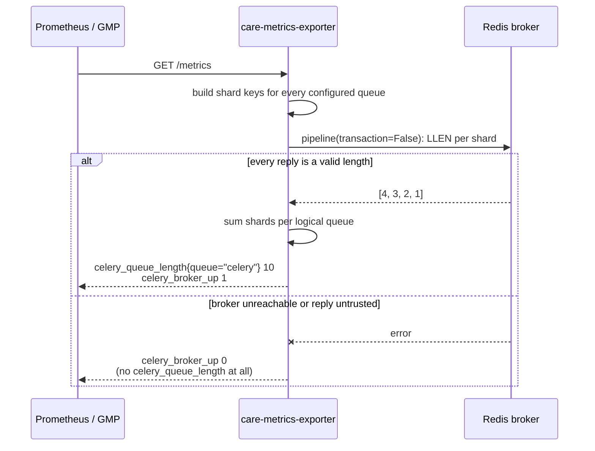

# CARE Metrics Exporter

A small Prometheus exporter that reports how many Celery tasks are waiting in
[CARE](https://github.com/ohcnetwork/care)'s Redis broker.

It is deliberately independent of CARE: it does not import CARE, start Django or
Celery, call CARE's API, or read CARE's health endpoint. It talks to Redis and
nothing else, so it keeps reporting even when CARE itself is down.

---

## Contents

- [How it works](#how-it-works)
- [Metrics](#metrics)
- [Failure behaviour](#failure-behaviour)
- [Configuration](#configuration)
- [Dependencies](#dependencies)
- [Running locally](#running-locally)
- [Testing](#testing)
- [Container image](#container-image)
- [Kubernetes](#kubernetes)
- [PromQL and alerting](#promql-and-alerting)
- [Runbook](#runbook)
- [Project layout](#project-layout)
- [Design decisions](#design-decisions)

---

## How it works

Celery does not keep a queue in one Redis list. Its Kombu Redis transport
**shards each queue across one list per priority step**. With Celery's defaults
(`0,3,6,9`), the queue named `celery` lives in four Redis keys:

| Priority | Redis key |
| --- | --- |
| 0 | `celery` |
| 3 | `celery\x06\x163` |
| 6 | `celery\x06\x166` |
| 9 | `celery\x06\x169` |

The separator is the two control bytes `\x06\x16`, and priority 0 uses the bare
queue name with no suffix. The **logical depth of a queue is the sum of `LLEN`
across all of its shards**.

The exporter reproduces that key layout with pure functions
(`redis_keys.py`) so it never has to import Celery or Kombu just to build four
keys.



Key properties:

- **Collection happens on the scrape.** There is no background poller, no cache,
  and no stored queue value.
- **One pipeline per scrape.** All shards for all queues are read in a single
  non-transactional round trip.
- **The reply is treated atomically.** If any shard read fails or returns
  something that is not a non-negative integer, the whole scrape is a failure.
- **One Redis connection pool** is created at startup and closed on shutdown.

## Metrics

| Metric | Type | Labels | Meaning |
| --- | --- | --- | --- |
| `celery_queue_length` | Gauge | `queue` | Messages waiting for the logical queue, summed across priority shards. **Only present when the whole read succeeded.** |
| `celery_broker_up` | Gauge | – | `1` if the last scrape read every shard, `0` otherwise. |
| `celery_queue_collection_duration_seconds` | Gauge | – | Wall-clock duration of the last attempt, successes and failures alike. |
| `celery_queue_collection_errors_total` | Counter | – | Failed attempts since process start. |
| `celery_queue_last_success_timestamp_seconds` | Gauge | – | Unix time of the last fully successful read. Absent until the first success. |

### What "queue length" does and does not mean

`celery_queue_length` is **ready depth**: work sitting in Redis that no worker
has picked up. It deliberately excludes:

- tasks already **reserved or executing** on a worker (tracked by Kombu's
  acknowledgement emulation, not the queue list);
- **ETA / countdown / scheduled** tasks;
- **unacked** messages awaiting completion.

A queue depth of `0` therefore means "nothing is waiting", not "there is no work
in flight". Worker-side counts need Celery events or worker instrumentation and
are out of scope here.

No broker URL, host, namespace, pod, error message, or exception class is ever
used as a metric label.

## Failure behaviour

This is the most important part of the contract.

| Situation | `/healthz` | `/metrics` HTTP | `celery_queue_length` | `celery_broker_up` |
| --- | --- | --- | --- | --- |
| Redis healthy | 200 | 200 | present | `1` |
| Redis unreachable | **200** | **200** | **absent** | `0` |
| Redis returns `WRONGTYPE` | 200 | 200 | absent | `0` |
| Another scrape still running | 200 | 200 | absent | `0` |
| Exporter still starting | 503 | – | – | – |

Two decisions drive this table:

**Queue metrics are omitted, never zeroed.** Emitting `0` when Redis is
unreachable is indistinguishable from a genuinely drained queue, and would
silently resolve a backlog alert during an outage. Omitting the series lets
Prometheus mark it stale instead.

**`/healthz` never contacts Redis.** If the probe failed during a broker outage,
Kubernetes would restart the pod and delete the only thing still reporting that
the broker is down. Broker health is reported through `celery_broker_up`; alert
on that, not on the pod.

## Configuration

All configuration is read from the environment once at startup and validated.
**Invalid configuration is fatal**; a broker that is merely unreachable is not.

| Variable | Default | Notes |
| --- | --- | --- |
| `CELERY_BROKER_URL` | – | **Required.** `redis://` or `rediss://`. Falls back to `REDIS_URL`, mirroring CARE's own default. |
| `REDIS_URL` | – | Compatibility fallback only. |
| `CELERY_QUEUES` | `celery` | Comma-separated. Trimmed, de-duplicated, control characters rejected. |
| `CELERY_REDIS_PRIORITY_STEPS` | `0,3,6,9` | Must start at `0`, be unique, strictly increasing, and within `0`–`9`. Match your Celery config. |
| `CELERY_REDIS_GLOBAL_KEYPREFIX` | *(empty)* | Set only if Celery uses a `global_keyprefix`. |
| `REDIS_SOCKET_CONNECT_TIMEOUT_SECONDS` | `2` | |
| `REDIS_SOCKET_TIMEOUT_SECONDS` | `5` | Keep below the Prometheus scrape timeout. |
| `COLLECTION_LOCK_TIMEOUT_SECONDS` | `1` | How long a scrape waits for an in-flight collection before failing fast. |
| `EXPORTER_HOST` | `0.0.0.0` | |
| `EXPORTER_PORT` | `8000` | |
| `LOG_LEVEL` | `INFO` | `DEBUG`, `INFO`, `WARNING`, `ERROR`, `CRITICAL`. |

The broker URL is treated as a credential throughout: it is excluded from the
settings `repr`, never logged, never echoed in a validation error, and never
exposed as a metric label or in an HTTP response.

Authentication, TLS, database selection, and redis-py query options
(for example `?ssl_cert_reqs=none`) are passed through untouched, because the
client is built with `redis.Redis.from_url()`.

## Dependencies

Runtime — just two, both pinned:

| Package | Version | Why |
| --- | --- | --- |
| [`prometheus-client`](https://pypi.org/project/prometheus-client/) | `0.26.0` | Metric types and text exposition. |
| [`redis`](https://pypi.org/project/redis/) | `7.0.1` | Broker client. Same major version CARE uses. |

Development: `pytest` and `ruff`.

Everything else — the HTTP server, threading, URL parsing — is standard library.
There is **no** Django, Celery, Kombu, Flask, or FastAPI dependency, at runtime
or in tests.

Python **3.13**, matching CARE. Dependencies are managed with `pipenv`
(`Pipfile` / `Pipfile.lock`), also matching CARE.

## Running locally

```bash
# 1. Install dependencies
pipenv install --dev

# 2. Start a Redis to point at
make redis-up

# 3. Run the exporter
export CELERY_BROKER_URL=redis://127.0.0.1:6379/0
pipenv run python -m care_metrics_exporter
```

Then:

```bash
curl -s localhost:8000/metrics | grep celery_
curl -s localhost:8000/healthz
```

To see a non-zero depth without running CARE, push directly onto the shards:

```bash
redis-cli LPUSH celery task-a task-b
redis-cli LPUSH "celery"$'\x06\x16'"3" priority-task
curl -s localhost:8000/metrics | grep celery_queue_length
# celery_queue_length{queue="celery"} 3.0
```

Or bring up Redis and the exporter together:

```bash
make up          # docker compose up --build
make down
```

## Testing

```bash
make test              # everything
make test-unit         # no Redis needed
make test-integration  # starts Redis, then runs the live tests
```

The suite has two layers:

- **Unit tests** use a fake pipeline and cover key construction, shard summing,
  every failure mode, counter monotonicity, and scrape serialisation. They need
  no external services.
- **Integration tests** (`-m integration`) talk to a **real Redis on
  `localhost:6379`**, using **database 15**, which is flushed before and after
  each test. They **skip automatically** when nothing is listening, so the suite
  stays green on a machine without Redis.

> ⚠️ Integration tests call `FLUSHDB` on database 15. Do not point them at a
> Redis you care about.

Lint and format, using the same Ruff ruleset as CARE:

```bash
make lint
make format
```

## Container image

```bash
make build   # docker build -f docker/prod.Dockerfile -t care-metrics-exporter:dev .
make run
```

The image follows CARE's `docker/prod.Dockerfile` structure — a shared `base`
stage, a `builder` stage that resolves the Pipfile lock into a virtualenv, and a
slim `runtime` stage that copies only that virtualenv plus the application.

It runs as **non-root** (UID/GID `10001`), contains no build toolchain, ships no
tests, and its `HEALTHCHECK` targets `/healthz` so a broker outage never marks
the container unhealthy.

Verify it is not running as root:

```bash
docker inspect care-metrics-exporter:dev --format '{{.Config.User}}'
# exporter

docker run --rm --entrypoint id care-metrics-exporter:dev
# uid=10001(exporter) gid=10001(exporter) groups=10001(exporter)
```

It also runs cleanly with `--read-only`, since it writes nothing to disk.

### Published images

Every push to `main` builds the production Dockerfile and publishes the image
to this repository's GitHub Container Registry package. The tag is the complete
Git commit SHA:

```text
ghcr.io/jesbinjoseph/care-metrics-exporter:<commit-sha>
```

For example:

```bash
docker pull ghcr.io/jesbinjoseph/care-metrics-exporter:$(git rev-parse HEAD)
```

The workflow uses GitHub's automatically provided `GITHUB_TOKEN`; it does not
need a separately configured registry password. Package visibility is managed
from the repository's **Packages** page.

## Kubernetes

The manifests in `kubernetes/` are a **minimal, self-contained deployment for
testing**. Production deployment for CARE on GCP is done through the Helm chart
and OpenTofu wiring in `egovhealthcare/gcp_template`.

```bash
kubectl apply -f kubernetes/deployment.yaml
kubectl apply -f kubernetes/service.yaml

# Only if you do not already have care-backend-secret in the namespace:
kubectl create secret generic care-backend-secret \
  --from-literal=CELERY_BROKER_URL='redis://redis.care.svc.cluster.local:6379/0'

# Optional, requires managed collection enabled on the cluster:
kubectl apply -f kubernetes/podmonitoring.yaml
```

Check it:

```bash
kubectl port-forward svc/care-metrics-exporter 8000:8000
curl -s localhost:8000/metrics | grep celery_
```

Notes:

- The Deployment injects **only** the `CELERY_BROKER_URL` key from
  `care-backend-secret` via `secretKeyRef`. It never uses `envFrom`, so the rest
  of CARE's backend secret is not exposed to the exporter.
- The container port and Service port are both named `metrics`; `PodMonitoring`
  selects by that name, so the three must stay in sync.
- Pod and container security contexts are hardened: non-root, read-only root
  filesystem, all capabilities dropped, no privilege escalation,
  `RuntimeDefault` seccomp, and no service account token mounted.
- The manifest uses an immutable commit-SHA tag already published by the CI
  workflow. Update that tag to the desired published commit when releasing a
  newer exporter version.

## PromQL and alerting

```promql
# Current depth
celery_queue_length{queue="celery"}

# Peak and average over an hour
max_over_time(celery_queue_length{queue="celery"}[1h])
avg_over_time(celery_queue_length{queue="celery"}[1h])

# Growth rate: is the backlog draining or building?
deriv(celery_queue_length{queue="celery"}[15m])
```

Alerting rules must be **failure-safe**. Because queue series disappear when
collection fails, a naive backlog alert would resolve itself during an outage.
Gate it on broker health:

```promql
# Backlog — cannot silently resolve because collection broke
(celery_queue_length{queue="celery"} > 200)
  and on() (celery_broker_up == 1)

# The broker read is failing
celery_broker_up == 0

# No successful collection for 5 minutes
time() - celery_queue_last_success_timestamp_seconds > 300

# Collection has never once succeeded
absent(celery_queue_last_success_timestamp_seconds) and on() (celery_broker_up == 0)

# The exporter itself is not being scraped
up{job="care-metrics-exporter"} == 0
```

If you scale beyond one replica, aggregate with `max by (queue)` — never `sum`,
which would multiply the depth by the replica count.

## Runbook

| Symptom | Likely cause | What to check |
| --- | --- | --- |
| `up == 0` | Pod down, or scrape config wrong | `kubectl get pods`, `PodMonitoring` status, port name `metrics` |
| `celery_broker_up == 0` | Redis unreachable, auth failure, or timeout | Exporter logs (reason is logged), Redis pod, NetworkPolicy, the Secret value |
| `celery_queue_length` missing but pod healthy | Expected — collection is failing | Same as above; this is the designed behaviour, not a bug |
| `celery_broker_up == 0` with reason `ResponseError` | A configured queue name collides with a non-list key (`WRONGTYPE`) | `redis-cli TYPE <queue>`; check `CELERY_QUEUES` |
| `celery_broker_up == 0` with reason `collection_busy` | Scrapes overlapping a slow broker | Raise `COLLECTION_LOCK_TIMEOUT_SECONDS`, or lengthen the scrape interval |
| Depth always `0` while work is clearly running | Wrong queue name, wrong priority steps, or a `global_keyprefix` mismatch | Compare `CELERY_QUEUES` and `CELERY_REDIS_PRIORITY_STEPS` with CARE's Celery config; `redis-cli KEYS 'celery*'` |
| Depth `0` but workers are busy | Correct — tasks are reserved, not waiting | Ready depth excludes reserved/active work |
| Pod restarts during a Redis outage | Should not happen | `/healthz` must not be pointed at `/metrics` |

Exporter logs never contain the broker URL or credentials. Failures are logged
with a bounded reason tag (the exception class name or `collection_busy`) and a
duration.

## Project layout

```text
care-metrics-exporter/
├── care_metrics_exporter/
│   ├── __init__.py
│   ├── __main__.py         # entry point: validate config, then serve
│   ├── collector.py        # scrape-time Prometheus collector
│   ├── config.py           # environment parsing and validation
│   ├── redis_keys.py       # Kombu-compatible key construction
│   ├── server.py           # HTTP server, lifecycle, graceful shutdown
│   └── tests/
│       ├── conftest.py
│       ├── test_collector.py
│       ├── test_config.py
│       ├── test_integration.py
│       ├── test_redis_keys.py
│       └── test_server.py
├── docker/
│   └── prod.Dockerfile
├── kubernetes/
│   ├── deployment.yaml
│   ├── podmonitoring.yaml
│   ├── secret.example.yaml
│   └── service.yaml
├── Makefile
├── Pipfile / Pipfile.lock
├── docker-compose.yaml
└── pyproject.toml
```

The layout follows CARE's conventions: the package sits at the repository root
(no `src/`), tests live inside the package, dependencies are managed with
Pipenv, the image lives in `docker/`, and `pyproject.toml` carries the same Ruff
ruleset.

## Design decisions

| Decision | Rationale |
| --- | --- |
| Standalone service, not a CARE endpoint or plugin | Queue depth is broker state, not application state. Coupling it to CARE would mean an API outage looks identical to a broker outage, and every API replica would publish duplicate series. |
| Omit queue metrics on failure instead of reporting `0` | A zero is indistinguishable from a drained queue and would resolve backlog alerts mid-outage. |
| `/healthz` never touches Redis | Otherwise a broker outage restarts the pod and removes the target reporting the outage. |
| Dedicated `CollectorRegistry` | Keeps the exposed contract to exactly five families. GMP already provides container-level metrics. |
| One connection pool for the process | Building a client per scrape leaks sockets under load. |
| Single-flight collection with a timeout | Stops slow broker reads from stacking up request threads. |
| Reimplement Kombu's key layout | Avoids importing Celery and Kombu — and CARE's whole dependency tree — to build four deterministic keys. |
| No payload decoding, no `KEYS`/`SCAN` | Only `LLEN` against keys derived from static configuration. Task contents are never read. |
| One replica by default | A cost default, not a correctness requirement. Prometheus disambiguates replicas by target labels; queries just need `max by (queue)`. |

### Out of scope for now

- Redis **Sentinel** and **Cluster** — no CARE environment uses them today, and
  shipping untested support would be a false promise. Standard `redis://` and
  `rediss://` are supported.
- Worker counts, active/reserved task counts, task runtimes, and throughput.
  These need Celery events or worker-side instrumentation, not broker reads.
- Per-priority-shard metrics. Shards are summed into one logical queue.
